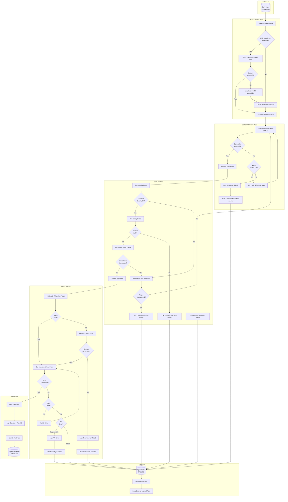

# LinkedIn Content Poster Agent

An automated agent that researches trending topics and posts content to LinkedIn on a scheduled basis.

## Overview

| Property | Value |
|----------|-------|
| **Trigger Type** | Scheduled (Cron) |
| **Default Schedule** | Daily at 10:00 AM |
| **Required Integrations** | LinkedIn, News API, LLM |
| **Complexity** | Medium |

## Use Case

> "I want an agent that posts LinkedIn content about AI trends every day at 10am"

This agent automates the entire content creation and posting workflow:
1. Research latest news/trends on specified topics
2. Generate engaging LinkedIn content
3. Run quality and safety evaluations
4. Post to LinkedIn automatically
5. Track engagement and learn from feedback

---

## Agent Configuration

```yaml
agent:
  name: "linkedin-ai-poster"
  description: "Posts daily AI-related content to LinkedIn"

trigger:
  type: "schedule"
  cron: "0 10 * * *"  # 10am daily
  timezone: "America/New_York"

permissions:
  linkedin:
    - "write:posts"
    - "read:profile"
  web_search:
    - "search:news"
  llm:
    - "generate:text"

settings:
  topics:
    - "artificial intelligence"
    - "machine learning"
    - "AI trends"
  tone: "professional thought-leader"
  content_length: "medium"  # 150-300 words
  include_hashtags: true
  max_hashtags: 5
  review_before_post: false  # Set true for approval workflow
```

---

## Execution Flow

### High-Level Flow

```
┌──────────┐    ┌──────────┐    ┌──────────┐    ┌──────────┐    ┌──────────┐
│ TRIGGER  │───▶│ RESEARCH │───▶│ GENERATE │───▶│   EVAL   │───▶│   POST   │
│ (10am)   │    │ (News)   │    │ (LLM)    │    │ (Check)  │    │(LinkedIn)│
└──────────┘    └──────────┘    └──────────┘    └──────────┘    └──────────┘
```

### Detailed Flow Diagram (Mermaid)



---

## Phase Details

### Phase 1: Research

The agent searches for recent news and trends on the configured topics.

**Tool Call:**
```python
result = platform.tools.search_news({
    query: "AI trends today",
    max_results: 10,
    date_range: "last_24h",
    sources: ["techcrunch", "wired", "verge", "mit_tech_review"]
})
```

**Fallback Chain:**
1. Primary: NewsAPI
2. Fallback 1: Bing News API
3. Fallback 2: Google News API
4. Fallback 3: Cached results (< 24h old)
5. Fallback 4: LLM knowledge with disclaimer

**Success Criteria:**
- At least 3 relevant articles found
- Articles from last 24 hours preferred

### Phase 2: Content Generation

The agent generates a LinkedIn post based on research results.

**Prompt Template:**
```
You are a thought leader in AI/technology. Based on the following recent news:

{research_results}

Write a LinkedIn post that:
- Is {content_length} (150-300 words)
- Uses a {tone} tone
- Includes insights or opinions, not just news summary
- Ends with a question or call to engagement
- Includes up to {max_hashtags} relevant hashtags

Do NOT:
- Use clickbait language
- Make unverified claims
- Include external links (LinkedIn deprioritizes them)
```

**Retry Logic:**
- Max 3 attempts
- Each retry uses modified prompt based on failure reason
- If all retries fail, alert user for manual intervention

### Phase 3: Evaluation

Every piece of content runs through the eval engine before posting.

**Quality Eval:**
```yaml
quality_eval:
  checks:
    - grammar_and_spelling: true
    - readability_score: "> 60"  # Flesch-Kincaid
    - length_within_bounds: true
    - no_placeholder_text: true
    - coherent_structure: true
```

**Safety Eval:**
```yaml
safety_eval:
  checks:
    - no_hate_speech: true
    - no_misinformation: true
    - no_personal_attacks: true
    - no_confidential_info: true
    - brand_safe: true
```

**Brand Voice Eval:**
```yaml
brand_eval:
  checks:
    - matches_tone: "professional"
    - no_controversial_opinions: true
    - aligns_with_topics: true
```

**If Eval Fails:**
- Content is regenerated with feedback
- Max 2 regeneration attempts
- If still failing, agent stops and alerts user

### Phase 4: Posting

The platform handles OAuth and posting securely.

**OAuth Flow:**
```
┌─────────────────────────────────────────────────────────────┐
│  LINKEDIN OAUTH HANDLING                                    │
│                                                             │
│  1. Agent calls: platform.integrations.linkedin.create_post │
│  2. Platform retrieves OAuth token from encrypted vault     │
│  3. Platform checks token expiry                           │
│     - If expired: auto-refresh using refresh_token         │
│     - If refresh fails: alert user to reconnect           │
│  4. Platform injects Authorization header                  │
│  5. Platform calls LinkedIn API                            │
│  6. Agent NEVER sees the OAuth token                       │
└─────────────────────────────────────────────────────────────┘
```

**Rate Limit Handling:**
- LinkedIn API: 100 posts/day limit
- If rate limited: wait and retry (exponential backoff)
- If persistent: schedule for next available slot

---

## Error Handling

| Error Type | Handling | User Impact |
|------------|----------|-------------|
| Search API Down | Use fallback APIs or cache | None (transparent) |
| LLM Generation Fails | Retry 3x, then alert | May miss daily post |
| Eval Rejects Content | Regenerate 2x, then alert | May miss daily post |
| OAuth Token Expired | Auto-refresh | None (transparent) |
| OAuth Refresh Fails | Alert to reconnect | Must reconnect LinkedIn |
| LinkedIn Rate Limited | Wait and retry | Delayed post |
| LinkedIn API Error | Retry or schedule later | Delayed post |

---

## Sandbox Mode (Optional)

For users who want human review before posting:

```yaml
settings:
  review_before_post: true
  review_timeout_minutes: 30
  auto_post_after_timeout: true  # or false to skip
```

**Workflow with Review:**
```
┌──────────────────────────────────────────────────────────────┐
│  SANDBOX MODE                                                │
│                                                              │
│  1. Agent generates content                                  │
│  2. Content saved as DRAFT (not posted)                      │
│  3. User notified: "Review today's LinkedIn post"           │
│  4. User can: Approve / Edit / Reject                       │
│  5. If approved: Post immediately                           │
│  6. If no action in 30 min: Auto-post (if enabled)          │
└──────────────────────────────────────────────────────────────┘
```

---

## Analytics & Learning

The agent tracks performance and learns over time.

**Tracked Metrics:**
- Post engagement (likes, comments, shares)
- Best performing topics
- Best posting times
- Content length preferences

**Self-Evolution:**
```yaml
self_evolution:
  enabled: true
  learn_from:
    - engagement_metrics
    - user_feedback
    - successful_patterns
  adjust:
    - topic_weights
    - content_style
    - posting_time
```

---

## Example Output

**Generated Post:**
```
The AI landscape is shifting faster than ever.

Yesterday's announcement about [specific news item] signals a
major change in how enterprises approach machine learning
infrastructure.

Three things stand out:

1. Cost efficiency is no longer optional - it's expected
2. Open-source models are closing the gap with proprietary ones
3. The focus is moving from "can we build it?" to "should we?"

What's fascinating is how quickly these changes are being
adopted. Six months ago, this would have been considered
bleeding edge. Today, it's becoming table stakes.

What's your organization's approach to staying current with
AI developments? Are you leading, following, or waiting?

#ArtificialIntelligence #MachineLearning #TechTrends #AI #Innovation
```

---

## Troubleshooting

### Agent not posting
1. Check LinkedIn connection in Dashboard > Integrations
2. Verify OAuth token is valid (try manual reconnect)
3. Check rate limits in Usage dashboard
4. Review agent logs for specific errors

### Content quality issues
1. Adjust topic configuration
2. Modify tone settings
3. Review and tune eval thresholds
4. Consider enabling sandbox mode for review

### Missed scheduled posts
1. Check agent status in Dashboard
2. Review execution logs
3. Verify trigger schedule is correct
4. Check for upstream API outages

---

## Related Documentation

- [Platform-Provided APIs](../architecture/platform-provided-apis.md)
- [Eval System](../architecture/eval-system.md)
- [OAuth Integration](../integrations/oauth-integration.md)
