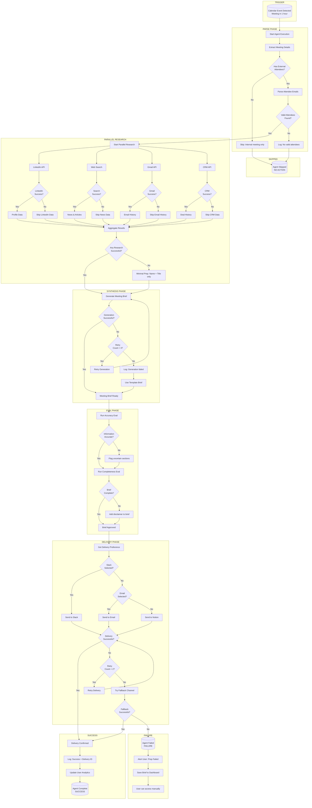

# Meeting Prep Assistant Agent

An event-driven agent that automatically prepares briefings before meetings by researching attendees and gathering relevant context.

## Overview

| Property | Value |
|----------|-------|
| **Trigger Type** | Event-driven (Calendar) |
| **Default Trigger** | 1 hour before meeting |
| **Required Integrations** | Calendar, Email/Slack (delivery) |
| **Optional Integrations** | LinkedIn, Gmail, CRM, Web Search |
| **Complexity** | High |

## Use Case

> "I want an agent that prepares me for every meeting on my calendar. If I have a meeting with Satya Nadella from Microsoft, I want to know everything about him before the meeting - delivered to my email or Slack."

This agent automates meeting preparation by:
1. Detecting upcoming calendar events
2. Identifying external attendees
3. Researching attendee backgrounds (parallel)
4. Gathering context from email history and CRM
5. Synthesizing into a structured briefing
6. Delivering to user's preferred channel

---

## Agent Configuration

```yaml
agent:
  name: "meeting-prep-assistant"
  description: "Prepares briefings before calendar meetings"

trigger:
  type: "event"
  source: "calendar"
  event: "meeting_starting"
  offset: "-1 hour"  # 1 hour before meeting

filters:
  # Only prep for meetings that match these criteria
  include:
    - has_external_attendees: true  # Skip internal-only meetings
    - min_attendees: 2
    - min_duration_minutes: 15
  exclude:
    - title_contains: ["1:1", "standup", "daily sync"]
    - organizer_is_me: false  # Only meetings I organized (optional)

permissions:
  google_calendar:
    - "read:events"
    - "read:attendees"
  gmail:
    - "read:threads"
    scope_filter: "participants:{{attendee_emails}}"
  linkedin:
    - "read:public_profiles"
  salesforce:
    - "read:contacts"
    - "read:opportunities"
    scope_filter: "email:{{attendee_emails}}"
  web_search:
    - "search:news"
    - "search:company_info"
  slack:
    - "write:dm"

settings:
  research_depth: "comprehensive"  # quick, standard, comprehensive
  include_sections:
    - about_person: true
    - recent_news: true
    - your_history: true
    - company_overview: true
    - talking_points: true
    - watch_out_for: true
  delivery_channel: "slack"  # email, slack, notion
  delivery_timing: "1_hour_before"  # 1_hour_before, night_before, 30_min_before
```

---

## Execution Flow

### High-Level Flow

```
┌──────────┐    ┌──────────┐    ┌──────────────┐    ┌───────────┐    ┌──────────┐
│ CALENDAR │───▶│  PARSE   │───▶│   PARALLEL   │───▶│ SYNTHESIZE│───▶│ DELIVER  │
│  EVENT   │    │ ATTENDEES│    │   RESEARCH   │    │  BRIEF    │    │ TO USER  │
└──────────┘    └──────────┘    └──────────────┘    └───────────┘    └──────────┘
```

### Detailed Flow Diagram (Mermaid)



---

## Phase Details

### Phase 1: Calendar Event Detection

The platform monitors the user's connected calendar for upcoming events.

**Event Processing:**
```yaml
event_received:
  meeting_id: "evt_abc123"
  title: "Partnership Discussion"
  start_time: "2024-01-15T14:00:00Z"
  duration_minutes: 60
  attendees:
    - email: "user@mycompany.com"
      name: "User"
      organizer: true
    - email: "satya.nadella@microsoft.com"
      name: "Satya Nadella"
      organizer: false
  location: "Zoom"
```

**Filter Logic:**
```python
def should_prepare(event):
    # Skip internal-only meetings
    external_attendees = [a for a in event.attendees
                         if not a.email.endswith("@mycompany.com")]
    if len(external_attendees) == 0:
        return False, "Internal meeting only"

    # Skip very short meetings
    if event.duration_minutes < 15:
        return False, "Meeting too short"

    # Skip excluded titles
    excluded = ["1:1", "standup", "daily sync"]
    if any(ex in event.title.lower() for ex in excluded):
        return False, "Excluded meeting type"

    return True, None
```

### Phase 2: Parallel Research

All research APIs are called simultaneously for speed.

```
┌─────────────────────────────────────────────────────────────┐
│  PARALLEL RESEARCH EXECUTION                                │
│                                                             │
│  ┌───────────┐  ┌───────────┐  ┌───────────┐  ┌───────────┐│
│  │ LinkedIn  │  │ Web Search│  │  Gmail    │  │   CRM     ││
│  │           │  │           │  │           │  │           ││
│  │ Profile   │  │ Recent    │  │ Email     │  │ Deal      ││
│  │ background│  │ news about│  │ history   │  │ history   ││
│  │ experience│  │ person &  │  │ with this │  │ notes     ││
│  │ role      │  │ company   │  │ person    │  │ opps      ││
│  └─────┬─────┘  └─────┬─────┘  └─────┬─────┘  └─────┬─────┘│
│        │              │              │              │       │
│        └──────────────┴──────────────┴──────────────┘       │
│                          │                                  │
│                          ▼                                  │
│              ┌─────────────────────┐                       │
│              │  Aggregate Results  │                       │
│              │  Graceful degradation│                       │
│              │  if any source fails │                       │
│              └─────────────────────┘                       │
└─────────────────────────────────────────────────────────────┘
```

**Research Tool Calls:**

```python
# All executed in parallel
linkedin_task = platform.tools.linkedin.get_profile({
    email: "satya.nadella@microsoft.com"
})

news_task = platform.tools.search_news({
    query: "Satya Nadella Microsoft",
    max_results: 5,
    date_range: "last_30_days"
})

email_task = platform.tools.gmail.search_threads({
    participants: ["satya.nadella@microsoft.com"],
    limit: 10
})

crm_task = platform.tools.salesforce.get_contact({
    email: "satya.nadella@microsoft.com",
    include: ["opportunities", "notes", "activities"]
})

company_task = platform.tools.search_company({
    name: "Microsoft",
    include: ["overview", "recent_news", "key_people"]
})

# Wait for all (with graceful degradation)
results = await gather_with_fallbacks([
    linkedin_task,
    news_task,
    email_task,
    crm_task,
    company_task
])
```

**Graceful Degradation:**

| Source | If Fails | Impact |
|--------|----------|--------|
| LinkedIn | Skip professional background | Brief still useful |
| Web Search | Skip recent news section | Brief still useful |
| Gmail | Skip "Your History" section | Brief still useful |
| CRM | Skip deal history | Brief still useful |
| All Sources | Use minimal template | Basic prep only |

### Phase 3: Synthesis

The LLM combines all research into a structured briefing.

**Prompt Template:**
```
You are preparing a meeting briefing. Based on the following research:

MEETING DETAILS:
{meeting_info}

ATTENDEE RESEARCH:
{research_results}

Create a structured briefing with these sections:

## Meeting Overview
- Title, time, duration
- Key attendees and their roles

## About {attendee_name}
- Current role and company
- Professional background
- Notable achievements

## Recent News
- Relevant news about the person
- Company news/announcements
- Industry context

## Your History
- Previous interactions
- Email thread summaries
- CRM notes/opportunities

## Talking Points
- Suggested topics based on context
- Questions to ask
- Common ground/connections

## Watch Out For
- Potential sensitive topics
- Recent challenges/changes
- Things to avoid

Keep the briefing concise but comprehensive. Flag any uncertain information.
```

### Phase 4: Delivery

The brief is delivered to the user's preferred channel.

**Delivery Options:**

```yaml
delivery_channels:
  slack:
    type: "dm"
    format: "rich_message"
    include_pdf: false

  email:
    type: "email"
    format: "html"
    subject: "Meeting Prep: {meeting_title}"
    include_pdf: true

  notion:
    type: "page"
    database_id: "user_configured"
    format: "markdown"
```

**Slack Message Format:**
```
┌─────────────────────────────────────────────────────────────┐
│  📋 Meeting Prep: Partnership Discussion                    │
│  ━━━━━━━━━━━━━━━━━━━━━━━━━━━━━━━━━━━━━━━━━━━━━━━━━━━━━━━  │
│                                                             │
│  📅 Today at 2:00 PM (1 hour)                              │
│  👤 With: Satya Nadella, CEO @ Microsoft                   │
│                                                             │
│  ─────────────────────────────────────────────────────────  │
│                                                             │
│  👤 ABOUT SATYA NADELLA                                    │
│  • CEO of Microsoft since 2014                             │
│  • Led cloud transformation (Azure grew 40%+ YoY)          │
│  • Background: Engineering, joined MS in 1992              │
│  • Known for: "Growth mindset" philosophy                  │
│                                                             │
│  📰 RECENT NEWS                                            │
│  • Yesterday: Announced new AI partnership with...         │
│  • Last week: Microsoft earnings beat expectations...      │
│                                                             │
│  🤝 YOUR HISTORY                                           │
│  • Met at Tech Summit 2024                                 │
│  • 3 email exchanges about cloud partnership               │
│  • Open opportunity: $2M Azure deal (Stage 3)              │
│                                                             │
│  💡 SUGGESTED TALKING POINTS                               │
│  • Reference your previous cloud discussion                │
│  • Ask about new AI initiatives announced yesterday        │
│  • Mention mutual connection: John Smith                   │
│                                                             │
│  ⚠️ WATCH OUT FOR                                          │
│  • Competitor XYZ just signed with Microsoft               │
│  • Recent reorg in Microsoft's partner team                │
│                                                             │
│  ─────────────────────────────────────────────────────────  │
│  [View Full Brief] [Dismiss] [Feedback]                    │
└─────────────────────────────────────────────────────────────┘
```

---

## Error Handling

| Error Type | Handling | User Impact |
|------------|----------|-------------|
| Calendar API Down | Agent doesn't trigger | No prep (relies on calendar) |
| No External Attendees | Skip gracefully | No prep needed |
| LinkedIn API Fails | Continue without | Partial brief |
| All Research Fails | Use minimal template | Basic prep only |
| LLM Generation Fails | Use template + raw data | Formatted but not synthesized |
| Delivery Fails | Try fallback channel | May be delayed |
| All Delivery Fails | Save to dashboard | User accesses manually |

---

## Integration Requirements

### Required Integrations

| Integration | Permissions | Purpose |
|-------------|-------------|---------|
| Google Calendar | `read:events`, `read:attendees` | Trigger and meeting details |
| Slack OR Email | `write:dm` OR `send:email` | Delivery channel |

### Optional Integrations (Enhanced Prep)

| Integration | Permissions | Adds to Brief |
|-------------|-------------|---------------|
| LinkedIn | `read:public_profiles` | Professional background |
| Gmail | `read:threads` (scoped) | Email history with attendee |
| Salesforce | `read:contacts`, `read:opportunities` | CRM data, deal history |
| HubSpot | `read:contacts`, `read:deals` | CRM data, deal history |
| Web Search | `search:news` | Recent news and articles |

---

## Privacy & Security

### Data Access Scoping

```yaml
# Gmail access is SCOPED to meeting attendees only
gmail:
  permission: "read:threads"
  scope_filter: "participants:{{attendee_emails}}"
  # Agent CANNOT read emails with other people
  # Only threads involving the specific meeting attendees
```

### What the Agent CANNOT Access

- Emails with people not in the meeting
- Calendar events for other meetings
- CRM data for unrelated contacts
- Any data outside scoped permissions

### Audit Trail

Every research action is logged:
```json
{
  "timestamp": "2024-01-15T13:00:00Z",
  "agent_id": "meeting-prep-assistant",
  "user_id": "user_123",
  "meeting_id": "evt_abc123",
  "actions": [
    {"tool": "linkedin.get_profile", "target": "satya.nadella@microsoft.com", "result": "success"},
    {"tool": "gmail.search_threads", "scope": "participants:satya.nadella@microsoft.com", "result": "3 threads"},
    {"tool": "salesforce.get_contact", "target": "satya.nadella@microsoft.com", "result": "found"}
  ]
}
```

---

## Self-Evolution

The agent learns from feedback to improve over time.

**Feedback Collection:**
- Did the user find the brief helpful?
- Which sections were most valuable?
- Was any information inaccurate?
- What was missing?

**Adaptive Behavior:**
```yaml
self_evolution:
  learn_from:
    - section_engagement  # Which sections user reads
    - feedback_ratings
    - meeting_outcomes  # If tracked
  adjust:
    - section_priority  # More valuable sections first
    - research_depth   # More/less detail based on feedback
    - delivery_timing  # Optimal time before meeting
```

---

## Example Output

**Full Meeting Brief:**

```markdown
# Meeting Prep: Partnership Discussion
**Date:** January 15, 2024 at 2:00 PM (1 hour)
**Location:** Zoom

---

## Attendees

| Name | Role | Company |
|------|------|---------|
| You | (Organizer) | Your Company |
| Satya Nadella | CEO | Microsoft |

---

## About Satya Nadella

**Current Role:** Chief Executive Officer at Microsoft (since 2014)

**Background:**
- Joined Microsoft in 1992 as a young engineer
- Led the cloud and enterprise group before becoming CEO
- Oversaw Microsoft's transformation into a cloud-first company
- Azure revenue grew from $4B to $60B+ under his leadership

**Leadership Style:**
- Known for promoting "growth mindset" culture
- Authored "Hit Refresh" about Microsoft's transformation
- Focuses on empathy and continuous learning

---

## Recent News

1. **Yesterday:** Microsoft announced expanded AI partnership with OpenAI, committing additional $10B investment
2. **Last Week:** Q4 earnings exceeded expectations; cloud revenue up 29%
3. **This Month:** Launched new Copilot features across Office 365

---

## Your History with Satya

**Previous Interactions:**
- Met briefly at Tech Summit 2024 (June)
- Exchanged 3 emails regarding potential Azure partnership

**Email Thread Summary:**
- June 15: Initial introduction via mutual connection
- June 22: Discussion about cloud migration needs
- July 3: Follow-up on partnership exploration

**CRM Data:**
- Contact created: June 15, 2024
- Open Opportunity: "Microsoft Azure Partnership" - $2M (Stage 3)
- Last activity: July 3, 2024

---

## Suggested Talking Points

1. **Reference Previous Conversation:** "When we last spoke about cloud migration, you mentioned..."
2. **AI Announcement:** "Congratulations on the expanded OpenAI partnership. How does this affect enterprise offerings?"
3. **Mutual Connection:** You both know John Smith from Acme Corp
4. **Cloud Journey:** Ask about lessons learned from Microsoft's own cloud transformation

---

## Watch Out For

- **Competitor Activity:** XYZ Corp (your competitor) announced Azure partnership last month
- **Org Changes:** Microsoft's enterprise sales team recently reorganized
- **Sensitive Topic:** Avoid discussing recent layoffs unless he brings it up

---

*Brief generated at 1:00 PM | Sources: LinkedIn, Google News, Gmail, Salesforce*
```

---

## Troubleshooting

### Agent not triggering
1. Check calendar connection in Dashboard > Integrations
2. Verify meeting has external attendees
3. Check filter settings (not excluding this meeting type)
4. Verify trigger timing (agent runs 1 hour before by default)

### Incomplete briefings
1. Check which integrations are connected
2. Some sources may have failed (check logs)
3. Adjust `research_depth` setting

### Delivery issues
1. Check delivery channel connection (Slack/Email)
2. Try alternate delivery channel
3. Access brief manually in Dashboard

---

## Related Documentation

- [Calendar Integration](../integrations/calendar-integration.md)
- [LinkedIn Integration](../integrations/linkedin-integration.md)
- [CRM Integrations](../integrations/crm-integrations.md)
- [Privacy & Data Access](../security/privacy-data-access.md)
