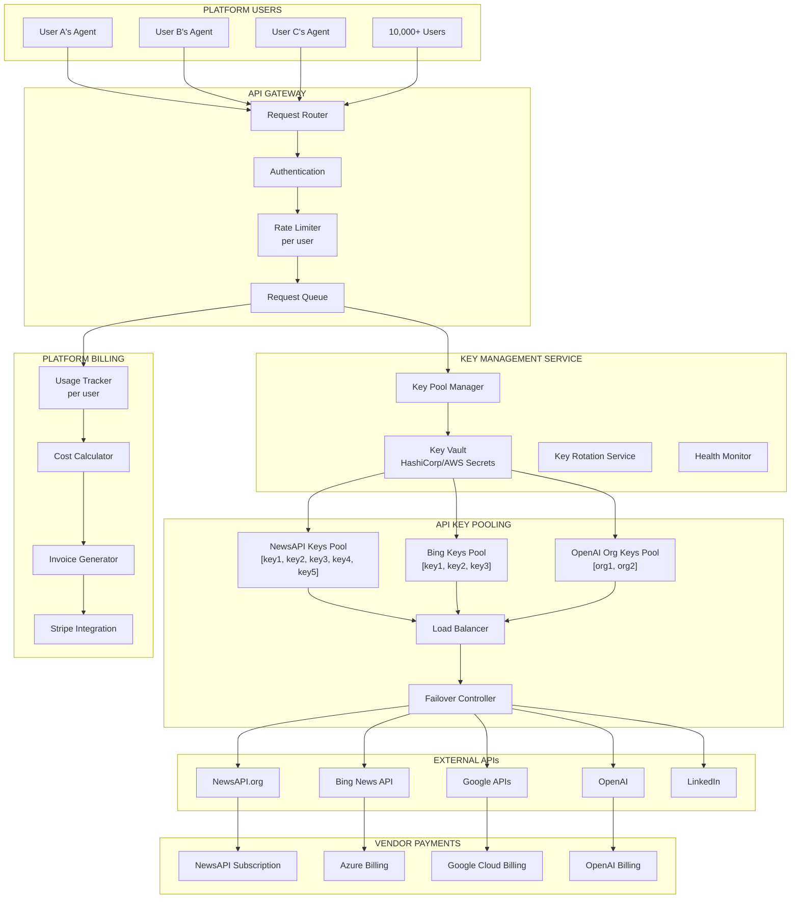
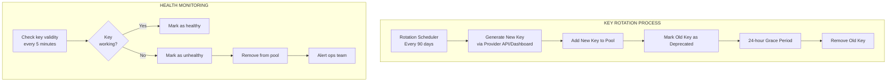
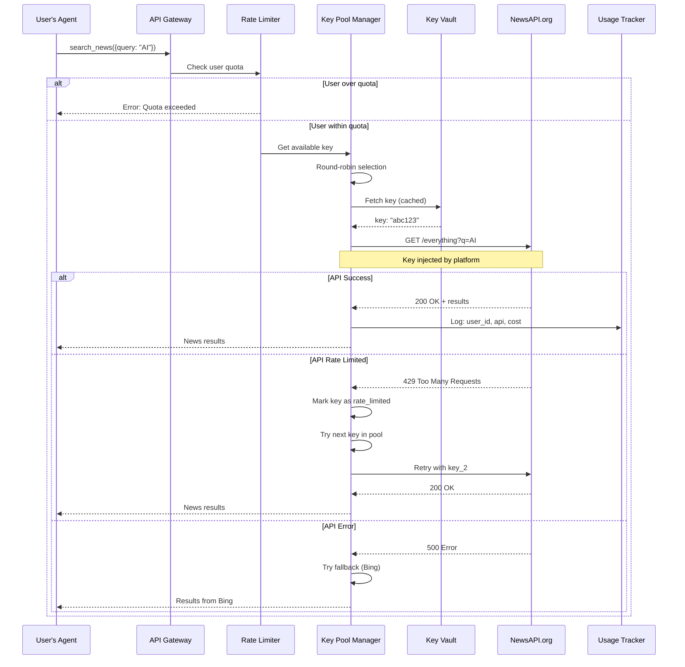
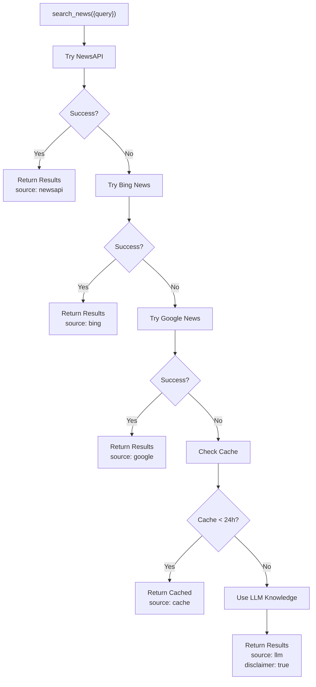

# Platform-Provided APIs

The platform manages external API integrations so users don't have to handle API keys, accounts, or billing with third-party providers.

## Overview

```
┌─────────────────────────────────────────────────────────────┐
│  USER EXPERIENCE                                            │
│                                                             │
│  Agent code:                                                │
│  result = platform.tools.search_news({ query: "AI trends" })│
│                                                             │
│  That's it. No API keys. No accounts. No billing setup.    │
└─────────────────────────────────────────────────────────────┘
                          │
                          │ Platform handles everything
                          ▼
┌─────────────────────────────────────────────────────────────┐
│  PLATFORM MANAGES (hidden from user):                       │
│                                                             │
│  • Multiple API provider accounts                          │
│  • API key rotation and security                           │
│  • Rate limiting and quota management                      │
│  • Fallback chains for reliability                         │
│  • Cost tracking and billing                               │
│  • Health monitoring and alerts                            │
└─────────────────────────────────────────────────────────────┘
```

---

## Architecture

### Complete System Diagram



---

## API Account Management

### Platform's API Accounts

The platform maintains business accounts with each API provider:

```
┌─────────────────────────────────────────────────────────────┐
│  PLATFORM API ACCOUNTS                                      │
│                                                             │
│  ┌─────────────────────────────────────────────────────┐   │
│  │  NewsAPI.org                                        │   │
│  │  ├── Account: platform@agentplatform.com           │   │
│  │  ├── Plan: Business ($449/month)                   │   │
│  │  ├── Quota: 250,000 requests/month                 │   │
│  │  ├── Keys: 5 API keys (for load balancing)         │   │
│  │  └── Billing: Credit card on file                  │   │
│  └─────────────────────────────────────────────────────┘   │
│                                                             │
│  ┌─────────────────────────────────────────────────────┐   │
│  │  Azure (Bing News API)                              │   │
│  │  ├── Account: azure@agentplatform.com              │   │
│  │  ├── Plan: Pay-as-you-go                           │   │
│  │  ├── Rate: $3 per 1,000 transactions               │   │
│  │  ├── Keys: 3 resource keys                         │   │
│  │  └── Billing: Azure invoice (NET 30)               │   │
│  └─────────────────────────────────────────────────────┘   │
│                                                             │
│  ┌─────────────────────────────────────────────────────┐   │
│  │  OpenAI                                             │   │
│  │  ├── Account: Organization account                 │   │
│  │  ├── Plan: Tier 5 (highest rate limits)            │   │
│  │  ├── Rate: Pay-per-token                           │   │
│  │  ├── Keys: 2 org-level keys                        │   │
│  │  └── Billing: Monthly invoice                      │   │
│  └─────────────────────────────────────────────────────┘   │
│                                                             │
│  ┌─────────────────────────────────────────────────────┐   │
│  │  Google Cloud (Custom Search, News)                 │   │
│  │  ├── Account: gcp@agentplatform.com                │   │
│  │  ├── Plan: Pay-as-you-go                           │   │
│  │  ├── Rate: $5 per 1,000 queries                    │   │
│  │  └── Billing: GCP invoice                          │   │
│  └─────────────────────────────────────────────────────┘   │
│                                                             │
│  ┌─────────────────────────────────────────────────────┐   │
│  │  LinkedIn (Marketing API)                           │   │
│  │  ├── Account: Partner program                      │   │
│  │  ├── Plan: Enterprise partner                      │   │
│  │  ├── Rate: Included in partnership                 │   │
│  │  └── Billing: N/A (partnership)                    │   │
│  └─────────────────────────────────────────────────────┘   │
└─────────────────────────────────────────────────────────────┘
```

---

## Key Vault & Security

### Secret Storage

All API keys are stored in an encrypted vault (AWS Secrets Manager or HashiCorp Vault).

```yaml
# secrets/api_keys.yaml (encrypted in vault)

news_apis:
  newsapi:
    provider: newsapi.org
    account_email: platform@agentplatform.com
    plan: business
    monthly_quota: 250000
    keys:
      - id: newsapi_1
        key: "encrypted:abc123..."
        created_at: 2024-01-01
        rotate_at: 2024-04-01
        status: healthy
        requests_today: 12450
      - id: newsapi_2
        key: "encrypted:def456..."
        status: healthy
        requests_today: 11200
      - id: newsapi_3
        key: "encrypted:ghi789..."
        status: rate_limited  # temporarily paused

  bing_news:
    provider: azure
    subscription_id: "sub-xxx"
    resource_group: "agentplatform-apis"
    keys:
      - id: bing_1
        key: "encrypted:xyz..."
        status: healthy

llm_apis:
  openai:
    org_id: "org-xxx"
    tier: 5
    keys:
      - id: openai_prod
        key: "encrypted:sk-..."
        rpm_limit: 10000
        tpm_limit: 2000000
```

### Key Rotation

Keys are automatically rotated for security:



---

## Request Flow

### How a Request is Processed



---

## Fallback Chains

Each tool type has a defined fallback chain for reliability.

### News Search Fallback



### Fallback Configuration

```yaml
fallback_chains:
  news_search:
    - provider: newsapi
      priority: 1
      timeout_ms: 5000
    - provider: bing_news
      priority: 2
      timeout_ms: 5000
    - provider: google_news
      priority: 3
      timeout_ms: 5000
    - provider: cache
      priority: 4
      max_age_hours: 24
    - provider: llm_knowledge
      priority: 5
      add_disclaimer: true

  llm_completion:
    - provider: openai
      model: gpt-4
      priority: 1
    - provider: anthropic
      model: claude-3
      priority: 2
    - provider: openai
      model: gpt-3.5-turbo
      priority: 3  # Fallback to faster/cheaper model

  web_search:
    - provider: serp_api
      priority: 1
    - provider: bing_search
      priority: 2
    - provider: google_search
      priority: 3
```

---

## Cost Management

### Platform Cost Structure

```
┌─────────────────────────────────────────────────────────────┐
│  MONTHLY API COSTS (Platform pays)                          │
│                                                             │
│  News & Search APIs:                                        │
│  ├── NewsAPI Business:        $449/month  (250K requests)  │
│  ├── Bing News (Azure):       ~$500/month (variable)       │
│  ├── Google Custom Search:    ~$300/month (variable)       │
│  └── Subtotal:                ~$1,250/month                │
│                                                             │
│  LLM APIs:                                                  │
│  ├── OpenAI:                  ~$5,000/month (variable)     │
│  ├── Anthropic:               ~$3,000/month (variable)     │
│  └── Subtotal:                ~$8,000/month                │
│                                                             │
│  Social & Other:                                            │
│  ├── LinkedIn API:            $0 (partner program)         │
│  ├── Twitter/X API:           $5,000/month (enterprise)    │
│  └── Subtotal:                ~$5,000/month                │
│                                                             │
│  ─────────────────────────────────────────────────────────  │
│  TOTAL MONTHLY API COSTS:     ~$14,250/month               │
└─────────────────────────────────────────────────────────────┘
```

### Pricing Model

Costs are baked into subscription tiers:

| Tier | Monthly Price | News Searches | LLM Tokens | Social Posts |
|------|---------------|---------------|------------|--------------|
| Free | $0 | 100 | 10,000 | 0 |
| Pro | $99 | 10,000 | 500,000 | 1,000 |
| Team | $299 | 100,000 | 2,000,000 | 10,000 |
| Enterprise | Custom | Unlimited | Unlimited | Unlimited |

### Overage Pricing

Usage beyond tier limits is billed separately:

| Resource | Overage Rate |
|----------|-------------|
| News/Search API calls | $0.001 per request |
| LLM tokens | $0.015 per 1K tokens |
| Social media posts | $0.01 per post |
| Agent executions | $0.005 per execution |

### Unit Economics Example

```
┌─────────────────────────────────────────────────────────────┐
│  PRO PLAN ECONOMICS ($99/month)                            │
│                                                             │
│  What user gets:                                           │
│  ├── 10,000 agent executions                               │
│  ├── 10,000 news/search API calls                          │
│  ├── 500,000 LLM tokens                                    │
│  ├── 1,000 social media posts                              │
│                                                             │
│  Platform cost per Pro user:                               │
│  ├── News APIs:      ~$0.50 (10K × $0.00005 avg)          │
│  ├── LLM tokens:     ~$5.00 (500K × $0.01/1K)             │
│  ├── Social APIs:    ~$0.10 (1K × $0.0001)                │
│  ├── Infrastructure: ~$2.00                                │
│  └── Total cost:     ~$7.60/user                          │
│                                                             │
│  Revenue:            $99.00                                │
│  Gross margin:       $91.40 (92%)                          │
└─────────────────────────────────────────────────────────────┘
```

---

## Tool Specifications

### News Search Tool

```yaml
tool: platform.tools.search_news
description: Search for recent news articles

inputs:
  query: string (required)
  max_results: number (default: 10, max: 100)
  date_range: enum [last_hour, last_24h, last_week, last_month]
  sources: string[] (optional)
  language: string (default: 'en')
  sort_by: enum [relevance, date, popularity]

outputs:
  articles:
    - title: string
      description: string
      url: string
      source: string
      published_at: datetime
      image_url: string | null
  metadata:
    source_api: enum [newsapi, bing, google, cache, llm]
    cached: boolean
    cache_age_seconds: number | null
    disclaimer: string | null

rate_limits:
  free_tier: 100/month
  pro_tier: 10,000/month
  team_tier: 100,000/month

example:
  input:
    query: "artificial intelligence trends"
    max_results: 5
    date_range: "last_24h"
  output:
    articles:
      - title: "OpenAI Announces New Model"
        description: "..."
        url: "https://..."
        source: "TechCrunch"
        published_at: "2024-01-15T10:00:00Z"
    metadata:
      source_api: "newsapi"
      cached: false
```

### LLM Completion Tool

```yaml
tool: platform.tools.llm.complete
description: Generate text using LLM

inputs:
  prompt: string (required)
  model: enum [gpt-4, gpt-3.5-turbo, claude-3] (optional)
  max_tokens: number (default: 1000)
  temperature: number (default: 0.7)
  system_prompt: string (optional)

outputs:
  text: string
  usage:
    prompt_tokens: number
    completion_tokens: number
    total_tokens: number
  metadata:
    model_used: string
    latency_ms: number

rate_limits:
  free_tier: 10,000 tokens/month
  pro_tier: 500,000 tokens/month
  team_tier: 2,000,000 tokens/month
```

### Social Media Tools

```yaml
tool: platform.integrations.linkedin.create_post
description: Create a LinkedIn post

inputs:
  content: string (required)
  visibility: enum [public, connections] (default: public)
  media_urls: string[] (optional)

outputs:
  success: boolean
  post_id: string
  post_url: string

permissions_required:
  - "write:posts"
  - "read:profile"

oauth:
  handled_by: platform
  user_connects_once: true
  auto_refresh: true
```

---

## Admin Dashboard

Platform operators have visibility into API health and costs:

```
┌─────────────────────────────────────────────────────────────┐
│  PLATFORM ADMIN > API MANAGEMENT                           │
│                                                             │
│  ┌─────────────────────────────────────────────────────┐   │
│  │  API HEALTH STATUS                       [Refresh]  │   │
│  │                                                      │   │
│  │  NewsAPI.org         ● Healthy     Usage: 67%       │   │
│  │  ├── Key 1           ● Healthy     12,450 today     │   │
│  │  ├── Key 2           ● Healthy     11,200 today     │   │
│  │  ├── Key 3           ● Rate Limited (paused 10m)    │   │
│  │  ├── Key 4           ● Healthy     9,800 today      │   │
│  │  └── Key 5           ● Healthy     8,900 today      │   │
│  │                                                      │   │
│  │  Bing News API       ● Healthy     Usage: 23%       │   │
│  │  Google News         ● Healthy     Usage: 5%        │   │
│  │  OpenAI              ● Healthy     Usage: 45%       │   │
│  │  LinkedIn            ● Healthy     Usage: 12%       │   │
│  └─────────────────────────────────────────────────────┘   │
│                                                             │
│  ┌─────────────────────────────────────────────────────┐   │
│  │  API COSTS (This Month)                             │   │
│  │                                                      │   │
│  │  Provider          Spend       Budget    Status     │   │
│  │  ─────────────────────────────────────────────────  │   │
│  │  NewsAPI           $449        $449      At limit   │   │
│  │  Azure (Bing)      $312        $600      OK         │   │
│  │  Google Cloud      $189        $400      OK         │   │
│  │  OpenAI            $4,230      $6,000    OK         │   │
│  │  Anthropic         $2,100      $4,000    OK         │   │
│  │  ─────────────────────────────────────────────────  │   │
│  │  TOTAL             $7,280      $11,449              │   │
│  └─────────────────────────────────────────────────────┘   │
│                                                             │
│  ┌─────────────────────────────────────────────────────┐   │
│  │  KEY MANAGEMENT                                     │   │
│  │                                                      │   │
│  │  [+ Add New API Key]  [Rotate All]  [Audit Log]     │   │
│  │                                                      │   │
│  │  Upcoming Rotations:                                │   │
│  │  • newsapi_key_1 - Rotate in 12 days               │   │
│  │  • bing_key_2 - Rotate in 34 days                  │   │
│  │  • openai_prod - Rotate in 67 days                 │   │
│  └─────────────────────────────────────────────────────┘   │
│                                                             │
│  ┌─────────────────────────────────────────────────────┐   │
│  │  ALERTS                                             │   │
│  │                                                      │   │
│  │  [WARN] NewsAPI at 67% quota (day 15/30)           │   │
│  │  [INFO] OpenAI tier upgrade available              │   │
│  │  [OK] All keys healthy                             │   │
│  └─────────────────────────────────────────────────────┘   │
└─────────────────────────────────────────────────────────────┘
```

---

## Implementation Checklist

```yaml
Phase 1: Foundation
  - [ ] Set up HashiCorp Vault or AWS Secrets Manager
  - [ ] Create platform accounts with each API provider
  - [ ] Store initial API keys in vault
  - [ ] Build Key Pool Manager service

Phase 2: API Gateway
  - [ ] Build request routing layer
  - [ ] Implement per-user rate limiting
  - [ ] Add key selection (round-robin/least-loaded)
  - [ ] Build fallback chain logic

Phase 3: Monitoring
  - [ ] Key health checks (every 5 min)
  - [ ] Usage tracking per user
  - [ ] Cost tracking per API
  - [ ] Alert system for failures/limits

Phase 4: Billing Integration
  - [ ] Track usage per user
  - [ ] Calculate costs per request type
  - [ ] Integrate with Stripe for overages
  - [ ] Monthly invoice generation

Phase 5: Admin Dashboard
  - [ ] API health status view
  - [ ] Cost dashboard
  - [ ] Key rotation UI
  - [ ] Alert management
```

---

## Related Documentation

- [Custom API Integration](../integrations/custom-api-integration.md)
- [Security & Credentials](../security/credentials-management.md)
- [Rate Limiting](./rate-limiting.md)
- [Billing & Usage](../billing/usage-tracking.md)
