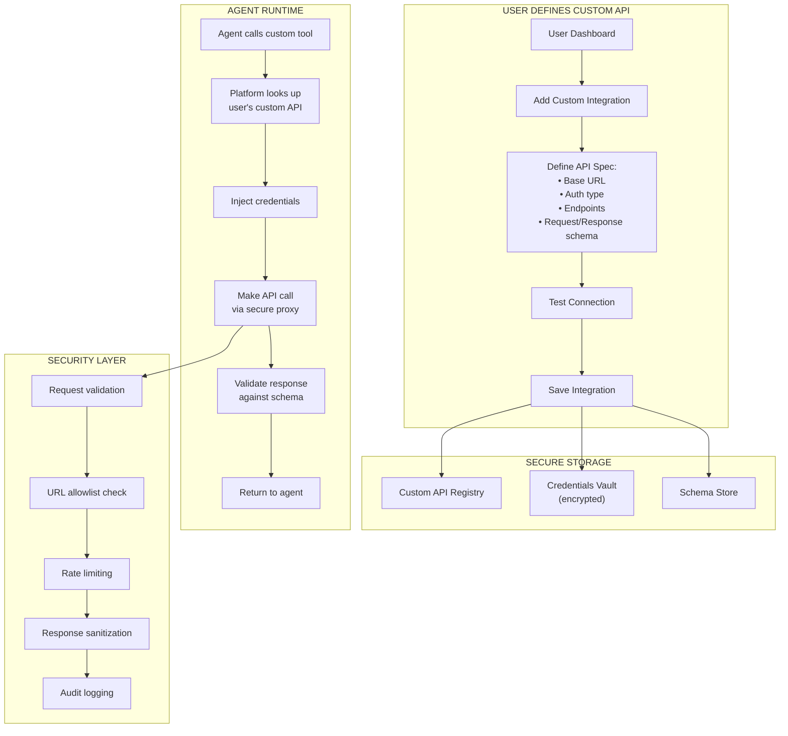
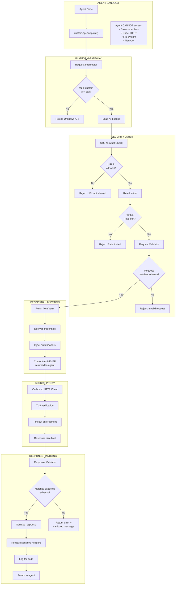
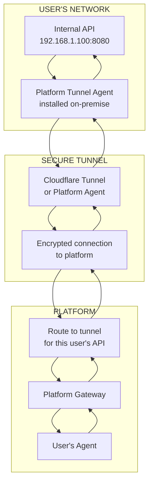

# Custom API Integration

Users can integrate their own APIs that the platform doesn't natively support, including internal company APIs, niche third-party services, and self-hosted tools.

## Overview

```
┌─────────────────────────────────────────────────────────────┐
│  CUSTOM API USE CASES                                       │
│                                                             │
│  ├── Internal company CRM (custom built)                   │
│  ├── Niche industry API (not supported by platform)        │
│  ├── Self-hosted services (on-premise tools)               │
│  ├── Private company tools (internal databases)            │
│  └── Webhook endpoints (Zapier, Make, custom)              │
│                                                             │
│  Platform doesn't know about these APIs - user defines them │
└─────────────────────────────────────────────────────────────┘
```

---

## Architecture

### Custom API Flow



---

## Adding a Custom API

### Step 1: Basic Information

```
┌─────────────────────────────────────────────────────────────┐
│  ➕ Add Custom API Integration                              │
│                                                             │
│  Step 1 of 4: Basic Information                            │
│  ━━━━━━━━━━━━━━━━━━━━━━━━━━━━━━━━━━━━━━━━━━━━━━━━━━━━━━━  │
│                                                             │
│  API Name *                                                │
│  ┌─────────────────────────────────────────────────────┐   │
│  │ My Company CRM                                      │   │
│  └─────────────────────────────────────────────────────┘   │
│                                                             │
│  Description                                               │
│  ┌─────────────────────────────────────────────────────┐   │
│  │ Internal CRM system for managing customer data      │   │
│  └─────────────────────────────────────────────────────┘   │
│                                                             │
│  Base URL *                                                │
│  ┌─────────────────────────────────────────────────────┐   │
│  │ https://crm.mycompany.com/api/v1                   │   │
│  └─────────────────────────────────────────────────────┘   │
│  ⚠️ Must be HTTPS. Internal URLs require tunnel setup.     │
│                                                             │
│                                        [Cancel] [Next →]   │
└─────────────────────────────────────────────────────────────┘
```

### Step 2: Authentication

The platform supports multiple authentication methods:

```
┌─────────────────────────────────────────────────────────────┐
│  Step 2 of 4: Authentication                               │
│  ━━━━━━━━━━━━━━━━━━━━━━━━━━━━━━━━━━━━━━━━━━━━━━━━━━━━━━━  │
│                                                             │
│  Authentication Type *                                     │
│  ┌─────────────────────────────────────────────────────┐   │
│  │ ○ None (Public API)                                 │   │
│  │ ● API Key                                           │   │
│  │ ○ Bearer Token                                      │   │
│  │ ○ Basic Auth (username/password)                    │   │
│  │ ○ OAuth 2.0                                         │   │
│  │ ○ Custom Header                                     │   │
│  └─────────────────────────────────────────────────────┘   │
│                                                             │
│  ─────────────────────────────────────────────────────────  │
│  API Key Configuration                                     │
│                                                             │
│  Header Name *                                             │
│  ┌─────────────────────────────────────────────────────┐   │
│  │ X-API-Key                                           │   │
│  └─────────────────────────────────────────────────────┘   │
│                                                             │
│  API Key *                                                 │
│  ┌─────────────────────────────────────────────────────┐   │
│  │ ••••••••••••••••••••••••••••••••                   │   │
│  └─────────────────────────────────────────────────────┘   │
│  🔒 Encrypted and stored securely. Never exposed to agents │
│                                                             │
│                                   [← Back] [Cancel] [Next →]│
└─────────────────────────────────────────────────────────────┘
```

#### Authentication Type Details

**API Key:**
```yaml
auth_type: api_key
config:
  header_name: "X-API-Key"  # or "Authorization"
  prefix: ""  # Optional prefix like "ApiKey "
  key: "encrypted:vault_ref"
```

**Bearer Token:**
```yaml
auth_type: bearer_token
config:
  token: "encrypted:vault_ref"
  # Adds: Authorization: Bearer <token>
```

**Basic Auth:**
```yaml
auth_type: basic_auth
config:
  username: "encrypted:vault_ref"
  password: "encrypted:vault_ref"
  # Adds: Authorization: Basic <base64(user:pass)>
```

**OAuth 2.0:**
```yaml
auth_type: oauth2
config:
  client_id: "encrypted:vault_ref"
  client_secret: "encrypted:vault_ref"
  token_url: "https://auth.example.com/oauth/token"
  scopes: ["read", "write"]
  # Platform handles token refresh automatically
```

**Custom Header:**
```yaml
auth_type: custom_header
config:
  headers:
    - name: "X-Custom-Auth"
      value: "encrypted:vault_ref"
    - name: "X-Tenant-ID"
      value: "tenant_123"
```

### Step 3: Define Endpoints

Users can import from OpenAPI spec or define manually:

```
┌─────────────────────────────────────────────────────────────┐
│  Step 3 of 4: Define Endpoints                             │
│  ━━━━━━━━━━━━━━━━━━━━━━━━━━━━━━━━━━━━━━━━━━━━━━━━━━━━━━━  │
│                                                             │
│  How would you like to define endpoints?                   │
│                                                             │
│  ┌─────────────────────────────────────────────────────┐   │
│  │ ● Import OpenAPI/Swagger spec (recommended)         │   │
│  │ ○ Define manually                                   │   │
│  │ ○ Let AI discover (experimental)                    │   │
│  └─────────────────────────────────────────────────────┘   │
│                                                             │
│  ─────────────────────────────────────────────────────────  │
│  Upload OpenAPI Specification                              │
│                                                             │
│  ┌─────────────────────────────────────────────────────┐   │
│  │                                                     │   │
│  │     📄 Drop your openapi.json or openapi.yaml      │   │
│  │                  or click to browse                 │   │
│  │                                                     │   │
│  └─────────────────────────────────────────────────────┘   │
│                                                             │
│  Or paste spec URL:                                        │
│  ┌─────────────────────────────────────────────────────┐   │
│  │ https://crm.mycompany.com/api/openapi.json         │   │
│  └─────────────────────────────────────────────────────┘   │
└─────────────────────────────────────────────────────────────┘
```

#### Manual Endpoint Definition

```
┌─────────────────────────────────────────────────────────────┐
│  Define Endpoints (Manual)                      [+ Add More]│
│                                                             │
│  ┌─────────────────────────────────────────────────────┐   │
│  │  Endpoint 1: Get Customer                           │   │
│  │  ─────────────────────────────────────────────────  │   │
│  │  Name *        │ get_customer                       │   │
│  │  Description   │ Retrieve customer by ID            │   │
│  │  Method *      │ [GET ▼]                            │   │
│  │  Path *        │ /customers/{customer_id}           │   │
│  │                                                     │   │
│  │  Path Parameters:                        [+ Add]    │   │
│  │  ┌─────────────────────────────────────────────┐   │   │
│  │  │ Name: customer_id                           │   │   │
│  │  │ Type: string                                │   │   │
│  │  │ Required: ✓                                 │   │   │
│  │  │ Description: The unique customer identifier │   │   │
│  │  └─────────────────────────────────────────────┘   │   │
│  │                                                     │   │
│  │  Response Schema (JSON):                            │   │
│  │  ┌─────────────────────────────────────────────┐   │   │
│  │  │ {                                           │   │   │
│  │  │   "id": "string",                           │   │   │
│  │  │   "name": "string",                         │   │   │
│  │  │   "email": "string",                        │   │   │
│  │  │   "company": "string"                       │   │   │
│  │  │ }                                           │   │   │
│  │  └─────────────────────────────────────────────┘   │   │
│  └─────────────────────────────────────────────────────┘   │
│                                                             │
│  ┌─────────────────────────────────────────────────────┐   │
│  │  Endpoint 2: Search Customers                       │   │
│  │  ─────────────────────────────────────────────────  │   │
│  │  Name *        │ search_customers                   │   │
│  │  Description   │ Search customers by query          │   │
│  │  Method *      │ [POST ▼]                           │   │
│  │  Path *        │ /customers/search                  │   │
│  │                                                     │   │
│  │  Request Body (JSON):                               │   │
│  │  ┌─────────────────────────────────────────────┐   │   │
│  │  │ {                                           │   │   │
│  │  │   "query": "string",                        │   │   │
│  │  │   "limit": "integer"                        │   │   │
│  │  │ }                                           │   │   │
│  │  └─────────────────────────────────────────────┘   │   │
│  └─────────────────────────────────────────────────────┘   │
└─────────────────────────────────────────────────────────────┘
```

### Step 4: Test & Save

```
┌─────────────────────────────────────────────────────────────┐
│  Step 4 of 4: Test Connection                              │
│  ━━━━━━━━━━━━━━━━━━━━━━━━━━━━━━━━━━━━━━━━━━━━━━━━━━━━━━━  │
│                                                             │
│  ┌─────────────────────────────────────────────────────┐   │
│  │  🧪 Testing Connection...                           │   │
│  │                                                      │   │
│  │  ✅ Base URL reachable                              │   │
│  │  ✅ Authentication valid                            │   │
│  │  ✅ Endpoint: get_customer - OK                     │   │
│  │  ✅ Endpoint: search_customers - OK                 │   │
│  │  ✅ Response schema validated                       │   │
│  │                                                      │   │
│  │  All tests passed!                                  │   │
│  └─────────────────────────────────────────────────────┘   │
│                                                             │
│  ─────────────────────────────────────────────────────────  │
│  Summary                                                   │
│                                                             │
│  API Name: My Company CRM                                  │
│  Base URL: https://crm.mycompany.com/api/v1               │
│  Auth: API Key (X-API-Key)                                │
│  Endpoints: 2                                              │
│                                                             │
│  Your agents can now use:                                  │
│  • custom.my_company_crm.get_customer()                   │
│  • custom.my_company_crm.search_customers()               │
│                                                             │
│                              [← Back] [Cancel] [Save API ✓]│
└─────────────────────────────────────────────────────────────┘
```

---

## Using Custom APIs in Agents

### Agent Code

```python
# Agent can now use the custom API like any platform tool

# Option 1: Direct tool call
customer = await platform.custom.my_company_crm.get_customer(
    customer_id="cust_12345"
)

# Option 2: Natural language (platform figures it out)
result = await platform.tools.call(
    "Look up customer information for John Smith in our CRM"
)
# Platform recognizes "CRM" → routes to custom.my_company_crm

# Option 3: Search customers
results = await platform.custom.my_company_crm.search_customers(
    query="John Smith",
    limit=10
)

# The agent NEVER sees:
# - The API key
# - The base URL
# - The auth headers
# Everything is injected by the platform
```

### Tool Discovery

Agents can discover available custom APIs:

```python
# List available custom tools
tools = await platform.custom.list()
# Returns: ["my_company_crm", "inventory_system", "internal_wiki"]

# Get tool schema
schema = await platform.custom.my_company_crm.schema()
# Returns full endpoint definitions for agent understanding
```

---

## Security Architecture

### Request Flow with Security



### Security Features

| Feature | Description |
|---------|-------------|
| **URL Allowlist** | Only URLs matching defined patterns are allowed |
| **TLS Required** | All connections must be HTTPS |
| **Credential Isolation** | Agent never sees API keys or tokens |
| **Request Validation** | Requests validated against defined schema |
| **Response Sanitization** | Sensitive headers stripped from responses |
| **Rate Limiting** | Per-API rate limits prevent abuse |
| **Timeout Enforcement** | Prevents hanging connections |
| **Audit Logging** | Every request logged for compliance |

---

## Internal/Private APIs

For APIs behind corporate firewalls:

### Connection Options

```
┌─────────────────────────────────────────────────────────────┐
│  🔒 Connect Internal/Private API                            │
│                                                             │
│  Your API is not publicly accessible. Choose how to connect:│
│                                                             │
│  ┌─────────────────────────────────────────────────────┐   │
│  │  Option 1: Cloudflare Tunnel (Recommended)          │   │
│  │  ─────────────────────────────────────────────────  │   │
│  │  • Install lightweight agent on your network        │   │
│  │  • Creates secure tunnel to platform               │   │
│  │  • No firewall changes needed                      │   │
│  │  • Free for basic usage                            │   │
│  │                                                     │   │
│  │  [Setup Cloudflare Tunnel →]                       │   │
│  └─────────────────────────────────────────────────────┘   │
│                                                             │
│  ┌─────────────────────────────────────────────────────┐   │
│  │  Option 2: Platform Agent (Enterprise)              │   │
│  │  ─────────────────────────────────────────────────  │   │
│  │  • Install our agent in your infrastructure        │   │
│  │  • Full control and audit logging                  │   │
│  │  • Docker/Kubernetes deployment                    │   │
│  │  • Available on Enterprise plan                    │   │
│  │                                                     │   │
│  │  [Contact Sales →]                                 │   │
│  └─────────────────────────────────────────────────────┘   │
│                                                             │
│  ┌─────────────────────────────────────────────────────┐   │
│  │  Option 3: IP Allowlisting                         │   │
│  │  ─────────────────────────────────────────────────  │   │
│  │  • Expose your API to specific IPs                 │   │
│  │  • Add our platform IPs to your firewall           │   │
│  │  • Platform IPs: 52.x.x.x, 54.x.x.x               │   │
│  │                                                     │   │
│  │  [View Platform IPs →]                             │   │
│  └─────────────────────────────────────────────────────┘   │
└─────────────────────────────────────────────────────────────┘
```

### Tunnel Architecture



---

## Configuration Schema

### Complete Custom API Configuration

```yaml
custom_api:
  id: "api_abc123"
  user_id: "user_xyz"
  name: "My Company CRM"
  slug: "my_company_crm"  # Used in agent code

  connection:
    base_url: "https://crm.mycompany.com/api/v1"
    timeout_ms: 30000
    retry_attempts: 3
    verify_ssl: true

  authentication:
    type: "api_key"  # api_key, bearer_token, basic_auth, oauth2, custom_header
    config:
      header_name: "X-API-Key"
      key_vault_ref: "vault://users/user_xyz/apis/api_abc123/key"

  endpoints:
    - name: "get_customer"
      description: "Retrieve customer by ID"
      method: "GET"
      path: "/customers/{customer_id}"
      parameters:
        - name: "customer_id"
          in: "path"
          type: "string"
          required: true
          description: "Unique customer identifier"
      response_schema:
        type: "object"
        properties:
          id: { type: "string" }
          name: { type: "string" }
          email: { type: "string" }
          company: { type: "string" }

    - name: "search_customers"
      description: "Search customers by query"
      method: "POST"
      path: "/customers/search"
      request_body:
        type: "object"
        properties:
          query: { type: "string" }
          limit: { type: "integer", default: 10 }
      response_schema:
        type: "array"
        items:
          $ref: "#/endpoints/0/response_schema"

  security:
    url_allowlist:
      - "https://crm.mycompany.com/*"
    rate_limit:
      requests_per_minute: 60
      requests_per_day: 10000
    ip_allowlist: null  # Or specific IPs for internal APIs

  tunnel:
    enabled: false
    type: null  # cloudflare, platform_agent
    tunnel_id: null

  metadata:
    created_at: "2024-01-15T10:00:00Z"
    updated_at: "2024-01-15T10:00:00Z"
    last_used_at: "2024-01-16T14:30:00Z"
    total_calls: 1247
    status: "active"
```

---

## Dashboard Management

### Custom APIs List

```
┌─────────────────────────────────────────────────────────────┐
│  ⚙️ Settings > Integrations > Custom APIs                   │
│                                                             │
│  ┌─────────────────────────────────────────────────────┐   │
│  │  Your Custom APIs                    [+ Add New API] │   │
│  │                                                      │   │
│  │  ┌─────────────────────────────────────────────┐    │   │
│  │  │  📦 Internal CRM API           [Connected ✓]│    │   │
│  │  │  Base URL: https://crm.mycompany.com/api   │    │   │
│  │  │  Auth: API Key                             │    │   │
│  │  │  Endpoints: 4 defined                      │    │   │
│  │  │  Last used: 2 hours ago                    │    │   │
│  │  │  Calls today: 127                          │    │   │
│  │  │  [Edit] [Test] [View Logs] [Delete]        │    │   │
│  │  └─────────────────────────────────────────────┘    │   │
│  │                                                      │   │
│  │  ┌─────────────────────────────────────────────┐    │   │
│  │  │  📦 Inventory System            [Connected ✓]│    │   │
│  │  │  Base URL: https://inventory.internal:8080 │    │   │
│  │  │  Auth: Bearer Token                        │    │   │
│  │  │  Endpoints: 2 defined                      │    │   │
│  │  │  Connection: Via Cloudflare Tunnel         │    │   │
│  │  │  [Edit] [Test] [View Logs] [Delete]        │    │   │
│  │  └─────────────────────────────────────────────┘    │   │
│  │                                                      │   │
│  │  ┌─────────────────────────────────────────────┐    │   │
│  │  │  📦 Legacy ERP                  [Error ⚠️]  │    │   │
│  │  │  Base URL: https://erp.mycompany.com       │    │   │
│  │  │  Status: Authentication failed             │    │   │
│  │  │  [Fix Connection] [Delete]                 │    │   │
│  │  └─────────────────────────────────────────────┘    │   │
│  └─────────────────────────────────────────────────────┘   │
└─────────────────────────────────────────────────────────────┘
```

### API Logs

```
┌─────────────────────────────────────────────────────────────┐
│  📊 Custom API Logs: Internal CRM API                       │
│                                                             │
│  Filter: [All Endpoints ▼] [Last 24 hours ▼] [All Status ▼]│
│                                                             │
│  ┌─────────────────────────────────────────────────────┐   │
│  │  Time         Endpoint          Status   Latency    │   │
│  │  ─────────────────────────────────────────────────  │   │
│  │  14:32:15     get_customer      200 OK   127ms     │   │
│  │  14:30:02     search_customers  200 OK   342ms     │   │
│  │  14:28:45     get_customer      200 OK   118ms     │   │
│  │  14:25:11     search_customers  200 OK   298ms     │   │
│  │  14:22:33     get_customer      404      89ms      │   │
│  │  14:20:01     get_customer      200 OK   134ms     │   │
│  └─────────────────────────────────────────────────────┘   │
│                                                             │
│  Summary (Last 24h):                                       │
│  • Total calls: 1,247                                      │
│  • Success rate: 99.2%                                     │
│  • Avg latency: 156ms                                      │
│  • Errors: 10 (8 x 404, 2 x timeout)                      │
└─────────────────────────────────────────────────────────────┘
```

---

## Error Handling

| Error | Cause | Resolution |
|-------|-------|------------|
| `AUTHENTICATION_FAILED` | Invalid or expired credentials | Update API key in dashboard |
| `ENDPOINT_NOT_FOUND` | API endpoint doesn't exist | Check endpoint configuration |
| `TIMEOUT` | API took too long to respond | Increase timeout or check API health |
| `RATE_LIMITED` | Too many requests | Wait or adjust rate limits |
| `SSL_ERROR` | TLS certificate issue | Check certificate validity |
| `CONNECTION_REFUSED` | API not accessible | Check URL and network connectivity |
| `SCHEMA_MISMATCH` | Response doesn't match schema | Update response schema |

---

## Best Practices

### API Definition

1. **Use OpenAPI specs** when available for accurate schema
2. **Define all parameters** including optional ones
3. **Document response schemas** for better agent understanding
4. **Set appropriate timeouts** based on API response times

### Security

1. **Use strong API keys** with appropriate permissions
2. **Rotate credentials regularly** (platform supports this)
3. **Set URL allowlists** to prevent unauthorized access
4. **Enable rate limiting** to prevent abuse

### Reliability

1. **Test connections** before deploying agents
2. **Monitor logs** for errors and latency issues
3. **Set up alerts** for connection failures
4. **Have fallback plans** for critical APIs

---

## Related Documentation

- [Platform-Provided APIs](../architecture/platform-provided-apis.md)
- [OAuth Integration](./oauth-integration.md)
- [Security & Credentials](../security/credentials-management.md)
- [Tunnel Setup Guide](./tunnel-setup.md)
